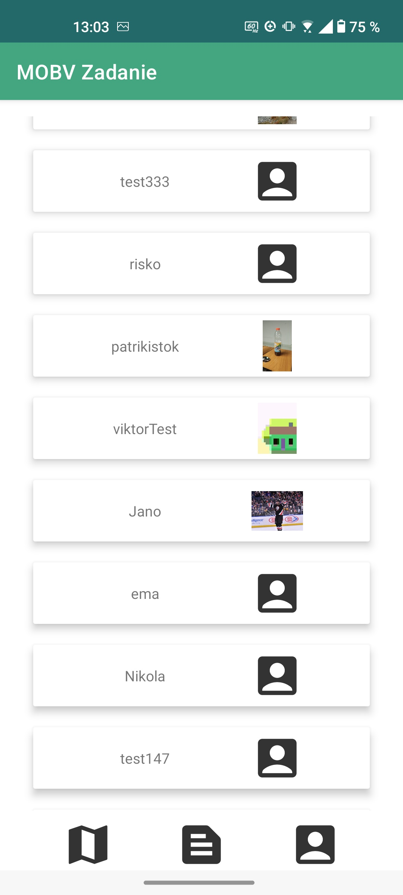
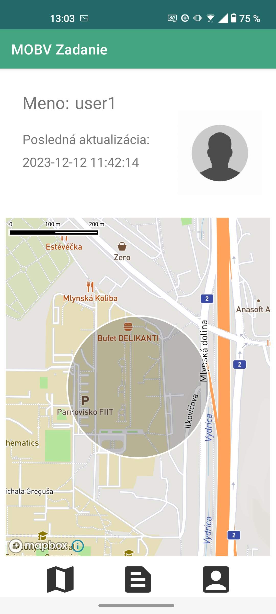
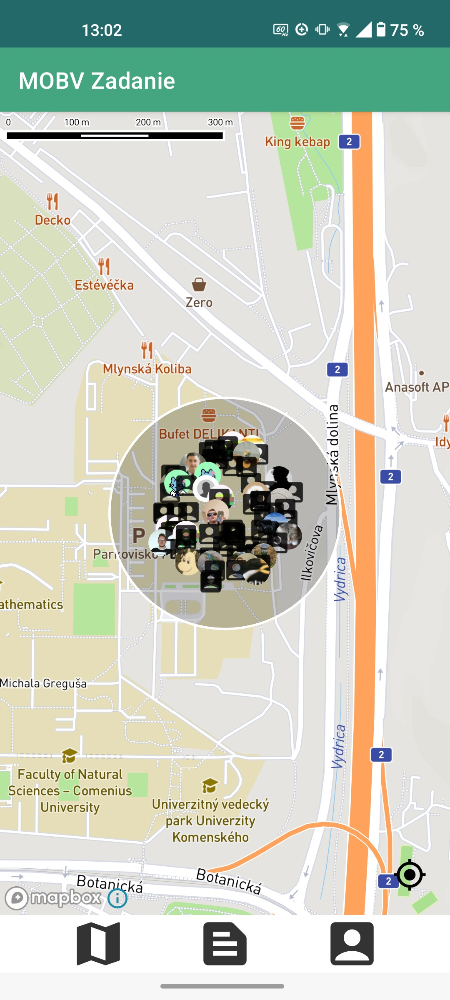
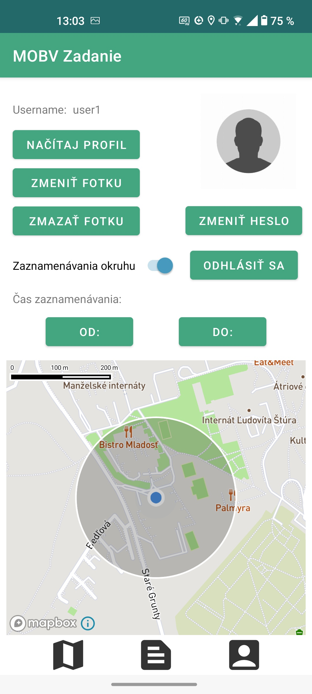

# Geofencing Mobile Application

## Overview

This Android mobile application implements a user geofencing system where users can register, login, view other users within a defined geofence, and receive notifications about users entering or leaving their vicinity. The app uses various Android components and libraries to ensure a smooth and efficient user experience. This project was developed as an university assignment for the subject "Mobilné výpočty" in FEI of Slovak University of Technology in Bratislava.

## Features

### Functional Part

1. **User Authentication**
   - **Registration**: Users can register an account.
   - **Login**: Users can log in to the application.
   - **Password Recovery**: Users can reset their forgotten password.
   - **Change Password**: Users can change their current password.
   
2. **Scrollable User List**
   - **User List**: Displays a list of users within the vicinity using `RecyclerView`.
<div align="center">
    
</div>

   - **Profile Linking**: Clicking on a user in the list navigates to their profile.
<div align="center">
    
</div>
   
3. **User Map**
   - **Geofencing Map**: Displays a map with users within the geofence as markers.
   - **Random User Placement**: Users are placed randomly within the geofence circle.

<div align="center">
    
</div>
   
4. **User Profile**
   - **Profile Management**: Users can view and update their profile, including profile picture.
   - **Location Sharing**: Users can manually or automatically enable/disable location sharing.
   - **Geofence Management**: Automatically create and manage geofence circles upon exit.
<div align="center">
    
</div>
   
5. **Background Location Check**
   - **Regular Updates**: The app checks for users in the vicinity at regular intervals.
   - **Notifications**: Sends notifications about the number of users nearby, and changes in user count.
   
6. **Profile Picture Management**
   - **Upload/Remove**: Users can upload or remove their profile picture.
   
7. **Navigation and Data Binding**
   - **Navigation**: Utilizes `Navigation` library for fragment transitions.
   - **Data Binding**: Implements `DataBinding` for efficient UI management.

8. **User Profile View**
   - **Profile Information**: Displays name, photo, and the last geofence circle of another user.

### UI and UX Part

- **Design Quality**: Ensures a user-friendly design with smooth functionality, intuitive navigation, and appropriate element sizes.
- **Performance**: The app performs efficiently without freezing or lagging.

## Technologies and Components

- **Language:** Kotlin
- **Architecture:** MVVM (Model-View-ViewModel)
- **Fragments, DataBinding, SharedPreferences, ViewModel, LiveData**: Used for various UI and data management tasks.
- **RecyclerView, Retrofit, Room, Coroutines, Repository Pattern, AuthInterceptor, TokenAuthenticator**: Used for displaying user lists and handling data operations.
- **MapBox**: For displaying users on a map within geofence circles.
- **BroadcastReceiver, Intent, Geofence, FusedLocationProvider**: For managing geofencing and location updates.
- **Worker, Notification**: For background processing and user notifications.
- **SQLite**: For local data storage.
- **Picasso**: For image loading.

## Installation

1. Clone the repository:
   ```sh
   git clone https://github.com/Gabor-Katona/MOBV-app.git
    ```
2. Open the project in Android Studio.
3. Sync the project with Gradle files.
4. Build and run the project on an Android device or emulator.